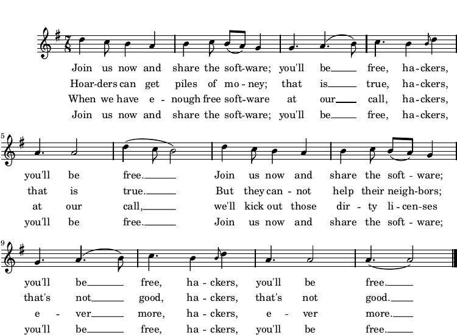

# 自由软件之歌

《自由软件之歌》歌词根据保加利亚民歌 _Sadi moma bela loza_ 的旋律而唱。如需收听该片断由传统风格演奏的保加利亚乐器伴奏的录音，请访问<https://gnu.org/music/FreeSWSong.ogg>。

这首歌曲采用 7/8 拍的节奏；那些不习惯奇数节拍的人们通常将这种非偶性看作一种错误。这种格律可以被分析为三个子小节：慢—快—快，或者 3—2—2。这样的格律在保加利亚音乐中经常被延伸，并且某些音乐家将此歌分析为 3—2—3；然而，后三拍不如前三拍长。Yves Moreau，此人收集并讲授舞蹈，推荐 7 拍的节奏。

1. 现在加入我们分享软件；您将得到自由，黑客们，您将得到自由。现在加入我们分享软件；您将得到自由，黑客们，您将得到自由。
2. 囤积者可以得到大堆金钱；这是真的，黑客们，这是真的。但他们不能帮助邻居；这不好，黑客们，这不好。
3. 如果我们有了足够的自由软件，在我手，黑客们，在我手。我们将踢开那些龌龊的许可证，到永久，黑客们，到永久。
4. 现在加入我们分享软件；您将得到自由，黑客们，您将得到自由。现在加入我们分享软件；您将得到自由，黑客们，您将得到自由。

著作权所有 (C) 2010 Richard Stallman

Richard Stallman 于 1991 年撰写了上述歌词。此版本的乐谱发表于“自由软件，自由社会：Richard M. Stallman 文选”第二版（波士顿：GNU Press，2010）。

允许在世界范围内以任何介质对此完整章节进行逐字复制和分发而无需权利金，如果此通知被保留。

[返回目录](00_index.html)

